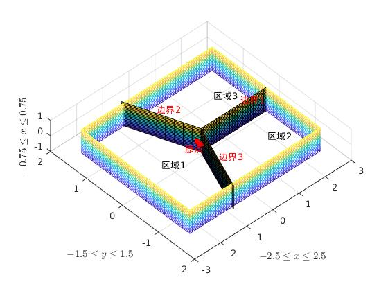

# Package Introduction

## Input
This package gets infromation about the relative positions between mbx, fwx and uav.

## Output
This package outputs the goal of joint values under a set of relative positions.

# 目前工作
- [ ] 构造一个代价函数，在给定一个三角形的情况下，把它分布在每个机器人特定的区域内。

# 优化框架

## 提前注明

为了接下来的表意方便，对符号作出如下约定

* $SE3$是齐次变换矩阵，为一个$4\times 4$矩阵，属于$SE(3)$空间中
* $SO3$是旋转矩阵，为一个$3\times 3$矩阵，属于$SO(3)$空间中

## 场地条件

我认为，这个场地是长10m，宽6m，高3m的长方体，因此在进行规划之前，首先要对轨迹和场地墙壁进行碰撞检测，保证轨迹和场地墙壁不会发生碰撞。

## 给定位置

存在一系列的离散时刻，可以称之为$t_0, t_1, \dots, t_n$这样$n$个时刻，这任意一个时刻$t_i,(1<i<n)$都有mbx, fwx和uav的相对位置，如果我们以**mbx为三者之间的原点**，那么三者之间的$SE3$如下

* mbx：

  * $$
    T_{mi}=\left[
     \begin{matrix}
       I_{3\times 3} & 0_{3\times 1} \\
       0_{1\times 3} & 1
      \end{matrix} 
    \right]
    =I_{4\times 4}
    $$
  
* fwx：

  * $$
    T_{fi}=\left[
     \begin{matrix}
       R_{fi\ 3\times 3} & P_{fi\ 3\times 1} \\
       0_{1\times 3} & 1
      \end{matrix} 
    \right]
    $$

* uav的坐标是

  * $$
    T_{ui}=\left[
     \begin{matrix}
       R_{ui\ 3\times 3} & P_{ui\ 3\times 1} \\
       0_{1\times 3} & 1
      \end{matrix} 
    \right]
    $$

这样就会存在2个向量

* 从mbx指向fwx的向量$P_{fi}=(x_{fi},y_{fi},z_{fi})$
* 从mbx指向uav的向量$P_{ui}=(x_{ui},y_{ui},z_{ui})$

从表面上看，这样会构成一个三角形

## 计算步骤

1. 我首先规定一个长方体，比如说就是整个房间的$\frac{1}{4}\sim \frac{3}{4}$高度，然后长宽也都是$\frac{1}{4}\sim \frac{3}{4}$，这样构成的一个长方体。
2. 既然我们获得了mbx, fwx和uav构成的三角形，那么我们不妨让整个三角形的重心位于这个长方体的中心，这样就可以保证他们都位于靠中间的位置，不至于让它们过于靠墙。那么，直觉上，这样会对三个机器人在空间中的部署比较有利。
3. 接下来的一个问题就是，确定了三角形的重心之后，这个三角形还是可以绕着重心进行旋转。因此，我们还需要对这个三角形的每一个角点进行确定。那么我们可以把这个长方体分成三个空间，也就是说按照等角$60^\circ$的方式分成三个空间，分别属于三个机器人。然后，设定一种函数，比如说跟角的两边与地面or上面的距离的平方，优化这个函数，得到三个末端在空间的位置。由于这是一个三角形，所以在将这个三角形分布到空间中的时候，末端绕自身的旋转也就确定了下来。因此，在考虑将三者的运动分配到三个空间中的时候，也可以将末端的运动加到代价函数上来
4. 这样可以计算得到一系列的离散路径点，对于这些得到的路径点，如果两个点之间太过稀疏，可以考虑对时间进行线性插值。
5. 那么，对于三个机械臂中的任意一个来说，任务就变成了机械臂末端的轨迹跟随。
6. 在获得了轨迹的情况下，我们可以以“可操作度”$\omega=\sqrt{\det(J^TJ)}$来描述当前机械臂的操作性能
7. 可以设定一个阈值范围，比如说可操作度$\omega$在区间$[a,b]$之间，操作臂的基底是不会发生运动的，但是如果$\omega<a$，那么就要发生基底的移动，让$\omega$重新回到$[a,b]$的区间之中。

# 具体计算

## 边界

对于上述的长方体，通过计算他的边界分别是
1. $x\in (-2.5, 2.5)$
2. $y\in (-1.5, 1.5)$
3. $x\in (-0.75, 0.75)$

以如下三个面为边界，分别构造出三个区域
1. 边界1：$y=0,0\le x\le 2.5, -0.75\le z\le 0.75$
2. 边界2：$y=-\sqrt{3}x, -\frac{\sqrt{3}}{2}\le x\le 0, -0.75\le z\le 0.75$
3. 边界3：$y=\sqrt{3}, -\frac{\sqrt{3}}{2}\le x\le 0, -0.75\le z\le 0.75$

三个边界如下图所示

其中区域1 $V_1$为mbx末端的运动区域，区域2 $V_2$为fwx的运动区域，区域3 $V_3$为uav的运动区域。

## 运动约束

1. 虽然我们已经将三者分别分配到三个区域之中，存在一定的对边界墙壁进行碰撞的能力，但是，直觉上，三者越靠近原点，其对于墙壁的避免碰撞能力将会有所上升。
   1. 解决：考虑将与墙面的距离的平方直接引入代价函数
   2. 问题：可能存在切变

2. 分成三个区域

# 中期思路

## 运动分配

### 输入

三个机器人的相对位型：

mbx：
$$
  T_{mi}=\left[
  \begin{matrix}
    I_{3\times 3} & 0_{3\times 1} \\
    0_{1\times 3} & 1
  \end{matrix} 
  \right]
  =I_{4\times 4}
$$

fwx:
$$
  T_{fi}=\left[
  \begin{matrix}
    R_{fi\ 3\times 3} & P_{fi\ 3\times 1} \\
    0_{1\times 3} & 1
  \end{matrix} 
  \right]
$$

uav:
$$
  T_{ui}=\left[
  \begin{matrix}
    R_{ui\ 3\times 3} & P_{ui\ 3\times 1} \\
    0_{1\times 3} & 1
  \end{matrix} 
  \right]
$$

在进行位置分配优化的时候，可能会对上述矩阵进行

## 运动规划